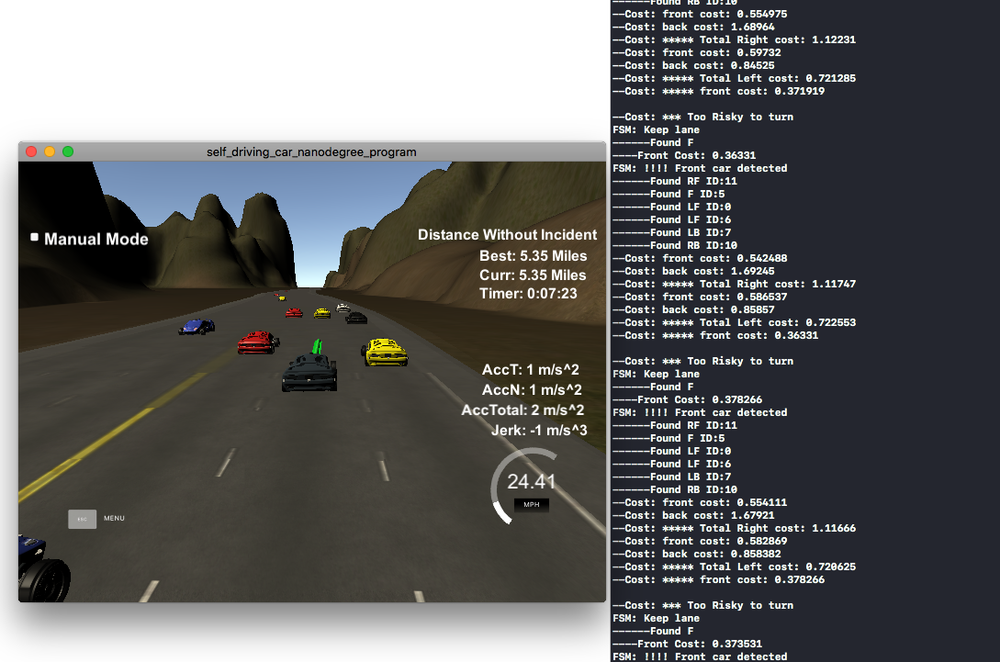
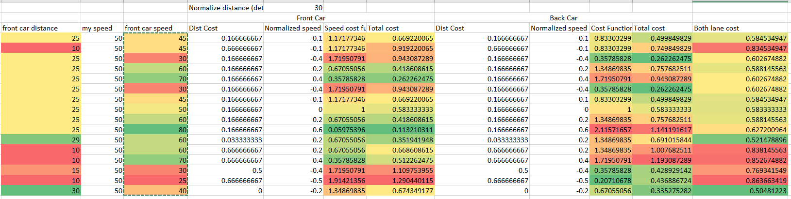
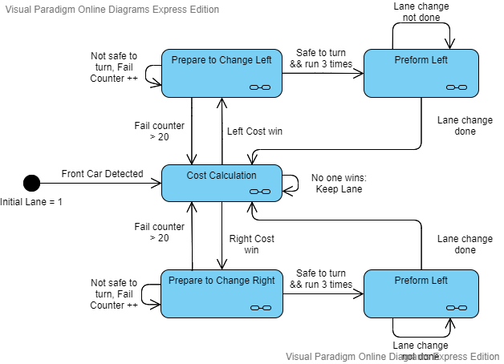

# CarND-Path-Planning-Project
Self-Driving Car Engineer Nanodegree Program
Detail Project description please visit: https://github.com/udacity/CarND-Path-Planning-Project

## Goal
In this project, your goal is to safely navigate around a virtual highway with other traffic that is driving +-10 MPH of the 50 MPH speed limit. You will be provided with the car's localization and sensor fusion data, there is also a sparse map list of waypoints around the highway. The car should try to go as close as possible to the 50 MPH speed limit, which means passing slower traffic when possible, note that other cars will try to change lanes too. The car should avoid hitting other cars at all costs as well as driving inside of the marked road lanes at all times unless going from one lane to another. The car should be able to make one complete loop around the 6946m highway. Since the car is trying to go 50 MPH, it should take a little over 5 minutes to complete 1 loop. Also, the car should not experience total acceleration over 10 m/s^2 and jerk that is greater than 10 m/s^3.
df
 
## Result Highlight

## Basic Build Instructions

1. Clone this repo.
2. Make a build directory: `mkdir build && cd build`
3. Compile: `cmake .. && make`
4. Run it: `./path_planning`.

---


## Dependencies

* cmake >= 3.5
  * All OSes: [click here for installation instructions](https://cmake.org/install/)
* make >= 4.1
  * Linux: make is installed by default on most Linux distros
  * Mac: [install Xcode command line tools to get make](https://developer.apple.com/xcode/features/)
  * Windows: [Click here for installation instructions](http://gnuwin32.sourceforge.net/packages/make.htm)
* gcc/g++ >= 5.4
  * Linux: gcc / g++ is installed by default on most Linux distros
  * Mac: same deal as make - [install Xcode command line tools]((https://developer.apple.com/xcode/features/)
  * Windows: recommend using [MinGW](http://www.mingw.org/)
* [uWebSockets](https://github.com/uWebSockets/uWebSockets)
  * Run either `install-mac.sh` or `install-ubuntu.sh`.
  * If you install from source, checkout to commit `e94b6e1`, i.e.
    ```
    git clone https://github.com/uWebSockets/uWebSockets 
    cd uWebSockets
    git checkout e94b6e1
    ```
## Key Points To Success 
Attention fellow Udacity students: I have stumbled into many bugs and lost too many hairs over those points that I listed below. Please pay close attention, and this would save you so much time.
* **EGO S**

    The ego car, i.e. the car you are controlling, is really important (obviously). Yet, its location in S is even more important. You need this to determine the gap you have between other vehicles. However, it would be also used to calculate the next set of waypoints. From the tutorial video in the class, you see this code:
    ```c++ 
    double car_s = j[1]["s"];
  ...
  ...
    if (prev_size >  0) {
                car_s = end_path_s;
            }
    ``` 
  This means `car_s` is read from the telemetry and have been changed right away if the previous path size is not 0. 
  If you refer to the car_s after this, your ego car position would be ahead of you, where ever the previous path has its last waypoint.
  `car_s = end_path_s` would make sure you will create new waypoints right after the previous last waypoint.
  If you use this `car_s` to calculate cost and gap distance when driving, you will have a high chance to cut off the vehicle behind you.
* **Sensor Data Limitation**

  You CANNOT trust the sensor readings 100%! Both in the simulation and real-world, there will be some time the sensor lost track of some cars, even if it is very obviously still there. Be sure to keep in mind the sensor data you read has the following property.
  *  **Continuity**: The readings might disappear and re-appear, but the cars on the road will not. (Unless they drive into a wormhole)
  *  **Too Close**: Sensors might not detect anything if the car is too close to your car. So, your car would think it's safe and ram over the car one meter in front of you.
  * **Prediction** To solve the previous two points, you need to have logic to predict other cars even if there are no readings.

* **Cost Function**
  
  The cost function is critical to comparing situations and determine which one is safer. Some creativity and math are needed to develop a cost function.


## Code and Structure Walk-through

### Shortcoming and Limitation
* No self-protection bubbles
* Cannot avoid other cars run into us
* starting lane is hardcoded. always start from lane 1
* Cost function limits are only tuned to handle this simulator
* Sensor data prediction limitations


### Code Structure
#### Class Definition 
I defined two classes, one is `Vehicle` and one is `List_Vehicle`. `Vehicle` hosts a single sensor reading data and contains all the necessary data. 
`List_Vehicle` contains the `vector<Vehicle>` and all the data related to the ego vehicle. All the functions that process sensor readings and cost function calculations are all in `List_vehicle` class.
#### Cost Function

The cost function I design takes into account the distance to the ego car and the speed of the sensor car. 
* Distance Normalize: 1- (ego to front car distance) / (detect range). One minus makes cost function penalized closer distance.
* Speed Normalize:((sensor car speed) - (ego car speed)) /(ego car speed)
* Speed cost formula: (2^(- Normalized Speed) - Normalized speed) for the vehicle in front of ego car. (2^(Normalized Speed) - Normalized speed) for the vehicle in the back of the ego car. If the front car speed is faster, it would have a lower cost. If the back car speed is slower, it would have a lower cost. Vise Versa. Add the normalized speed again to make the weight heavier for super fast and super slow vehicles.
* Total cost: the sum of speed cost and distance cost and divide by two 
* Final cost would be average of front and back cost if both have value. If only have one value, only take the one with value.


#### Finite State Machine

#### Way Points Creation and Lane Change

The WayPoints creation followed the tutorial video from the classroom

